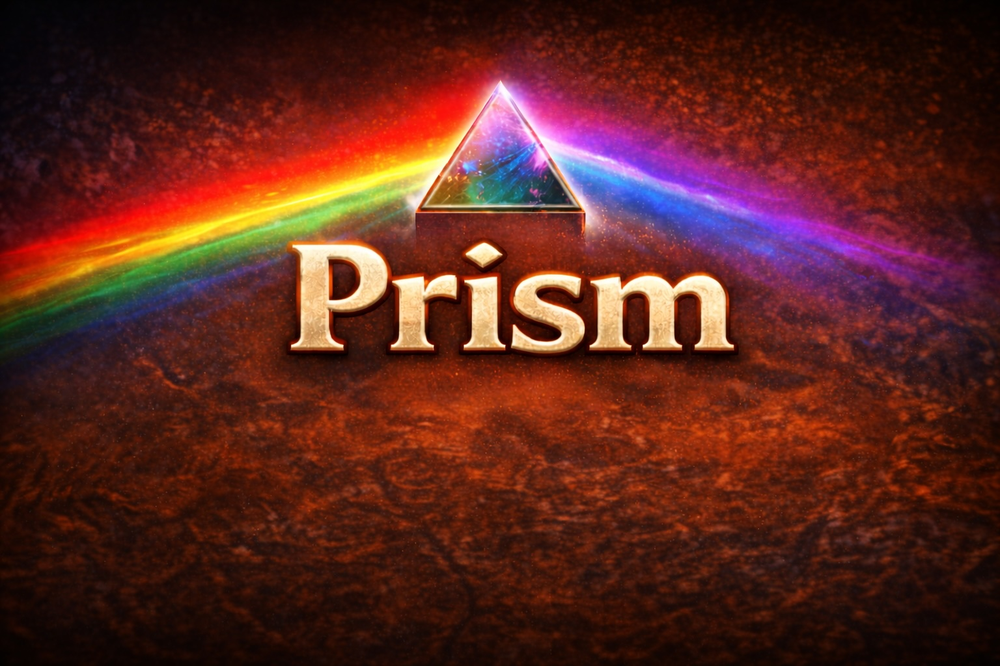

# Prism

A World of Warcraft Forever addon that makes action buttons respond visually to gameplay situations.

## Features

- Prism highlights an action button while the player has a buff with the same client spell ID.

## Installation

- Download Prism from [CurseForge](https://www.curseforge.com/wow/addons/prism).
- Extract Prism into the `Interface/AddOns/` directory for the Forever client.
- Restart WoW, or type `/reload` if the game is open.
