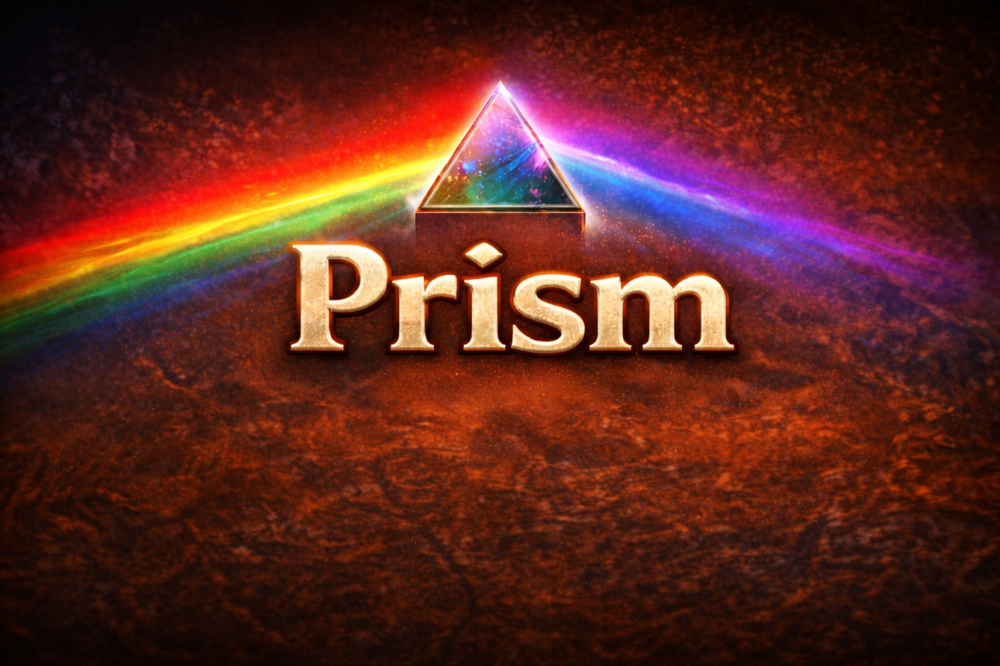

# Prism

A World of Warcraft Forever addon that makes action buttons respond visually to gameplay situations.



## Features

### General

- _Player buffs:_ Highlights an action button while the player has a buff with the same client spell ID.
- _Healing:_ Highlights **bandages** while the heal target has full health. A usable bandage blinks red while the heal target has a poison debuff.
- _Poison cleansing:_ Glows **Anti-Venom**, **Strong Anti-Venom**, **Powerful Anti-Venom**, and **Potent Anti-Venom** while the item is usable and the heal target has a poison debuff.
- _Disease cleansing:_ Glows **Simple Poultice**, **Clever Poultice**, **Superior Poultice**, and **Powerful Poultice** while the item is usable and the heal target has a disease debuff.

### Warrior

- _Own target debuffs:_ **Rend** — Highlights while the target has the player's debuff.
- _Shared target debuffs:_ **Hamstring**, **Demoralizing Shout**, **Thunder Clap** — Highlights while the target has the matching debuff.
- _Shared target debuff stacks:_ **Sunder Armor** — Highlights when fully stacked.
- _Tanking:_ **Taunt**, **Mocking Blow**, **Challenging Shout** — Highlights while the player tanks the target.
- _Usable attacks:_ **Execute**, **Overpower**, **Revenge**, **Victory Rush** — Glows while the spell is usable.
- _Interrupts:_ **Shield Bash** — Glows during a hostile target cast or channel while the spell is usable.
- _Fear warning:_ **Intimidating Shout** — Blinks red while the spell is usable and the hostile target has **Rend** or **Deep Wound** from any caster.

### Hunter

- _Own target debuffs:_ **Serpent Sting** — Highlights while the target has the player's debuff.
- _Shared target debuffs:_ **Hunter's Mark**, **Concussive Shot**, **Wing Clip** — Highlights while the target has the matching debuff from any caster.
- _Usable attacks:_ **Mongoose Bite** — Glows while the spell is usable.
- _Pet healing:_ **Mend Pet** — Highlights while the player's living pet has full health. The highlight does not require a usable action.

## Installation

- Download Prism from [CurseForge](https://www.curseforge.com/wow/addons/prism).
- Extract Prism into the `Interface/AddOns/` directory for the Forever client.
- Restart WoW, or type `/reload` if the game is open.

## Architecture

The main file selects the shared rules and the current class rules. The core contains no class-specific branches.

| File | Responsibility |
| --- | --- |
| `Core.lua` | Implements action matching, mechanics, visuals, secure aura containers, placement, and refresh control. |
| `Shared.lua` | Defines class-independent rules and item IDs. |
| `Classes/Warrior.lua` | Defines Warrior spell IDs, aura IDs, and feedback rules. |
| `Classes/Hunter.lua` | Defines Hunter spell IDs, aura IDs, and feedback rules. |
| `Prism.lua` | Selects the rules and starts the core. |

The TOC loads these files in that order. Add each class file after `Shared.lua` and before `Prism.lua` in `Prism.toc`.

### Rules

Each rule defines a unique `key`, an `action` selector, a `condition`, and a `visual`.

Action selectors match spell IDs, item IDs, or item categories. The shared self-buff rule matches any spell action.

Spell selectors also match the base spell ID. Aura filters match only their declared IDs.

Keep action IDs separate from aura IDs. Set `includeActionSpellID` only when the action can also identify the aura.

Several rules can apply to one action. Each aura rule uses a separate secure container for its filter and alpha.

| Mechanic | Condition |
| --- | --- |
| `aura` | A declared buff or debuff is active on the selected unit. |
| `aura-stacks` | A declared aura reaches the specified application count. |
| `dispel-type` | A debuff with the specified dispel type is active on the selected unit. |
| `full-health` | The selected unit exists, is alive, and has full health. |
| `usable` | The action is usable. |
| `target-cast` | A living hostile target casts or channels, and the action is usable. |
| `tanking` | The player tanks the living hostile target. |

The unit can be `player`, `pet`, `target`, or `heal-target`. The heal target is an assistable current target, or the player if no assistable target exists.

Set `requireUsable` on an aura rule to require a usable action. Set `ownAura` with the `PLAYER` filter to restrict the caster.

The visuals are `highlight`, `red-blink`, and `glow`. The core keeps condition alpha separate from animation alpha.

### Validation

Use Lua 5.1 for the syntax checks and tests.

```bash
luac5.1 -p Prism.lua Core.lua Shared.lua Classes/*.lua tests/*.lua
lua5.1 tests/fear-warning.lua
lua5.1 tests/hunter.lua
lua5.1 tests/mechanics.lua
lua5.1 tests/rules.lua
bash -n install.sh
bash -n tests/install.sh
bash tests/install.sh
```

Run `./install.sh` to install every source file listed in the TOC. Set `PRISM_ADDON_DIRECTORY` to install in another directory.

Use `/reload`, then test the behavior in and out of combat. Test action paging, bar visibility, UI scaling, and spell movement.
